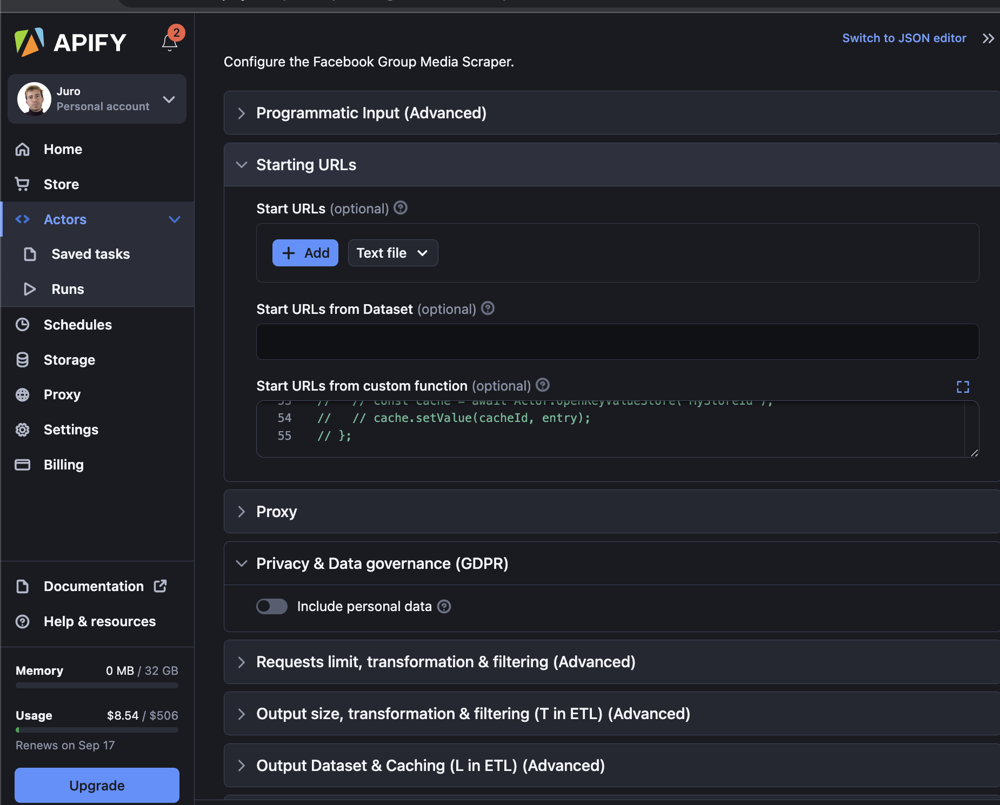

# CrawleeOne

_The web scraping framework you can't refuse._

CrawleeOne is a feature-rich and highly configurable web scraping framework that empowers both scraper developers and their users.

It is built on top of Crawlee and Apify\*. [Read here](./docs/scraping-workflow-summary.md) for the recap of how Crawlee and Apify work.

The appeal of CrawleeOne is that it works seamlessly with Apify platforn,
but can also be easily re-purposed to work with other web scraping platforms or your custom services.

When [deployed to Apify](#deploying-to-apify), or otherwise made available to be used by others,
**the users of your scraper will have the freedom to transform, filter, limit, or otherwise
modify both the scraped data and the requests to scrape.**

CrawleeOne should be especially your choice if:

- You're developing a long-lasting integrations.
- Or your scraper will be part of a data pipeline.
- Or you wish to make your scrapers available to others in your team / org, whether it's programmatically or via Apify UI.

> NOTE: `crawleeOne` allows you to easily switch between different implementations - Playwright, Cheerio, Puppeteer, ...
>
> However, you still need to write data extraction logic that's specific to the implementation.
>
> To make the transition between different implementations seamless, you can use [`portadom`](https://github.com/JuroOravec/portadom),
> which offers a single interface across all these implementations.

## Pre-requirements

To make the most of CrawleeOne, you should be familiar with:

- Crawlee (AKA how to scrape data).
- Apify platform (AKA how to manage a scraped dataset and request queue).

## Table of contents

- [Minimal example](#minimal-example)
- [What can CrawleeOne do?](#what-can-crawleeone-do)
- [Playbook & Use cases](#playbook--use-cases)
- [Actor input reference](#actor-input-reference)
- [Usage (for developers)](#usage-for-developers)
- [Deploying to Apify](#deploying-to-apify)
- [Usage (for end users)](#usage-for-end-users)
- [Codegen & Config file](#codegen--config-file)
- [Custom telemetry integration (CrawleeOneTelemetry)](#custom-telemetry-integration-crawleeonetelemetry)
- [Custom platform and storage integration (CrawleeOneIO)](#custom-platform-and-storage-integration-crawleeoneio)
- [Example projects](#example-projects)
- [Contributing](#contributing)
- [Supporting CrawleeOne](#supporting-crawleeone)

## Minimal example

Following example defines a [CheerioCrawler](https://crawlee.dev/docs/guides/cheerio-crawler-guide)
scraper with 2 routes (`mainPage` and `otherPage`) that process the incoming URLs either based on the URL,
or on the page HTML.

`pushData` is used to save the scraped data, while `pushRequests` enqueues more URLs to be scraped.

```ts
import { crawleeOne } from 'crawlee-one';

await crawleeOne({
  type: 'cheerio',
  routes: {
    mainPage: {
      match: /example\.com\/home/i,
      handler: async (ctx) => {
        const { $, request, pushData, pushRequests } = ctx;
        // Scrape data from the page
        const data = [
          /* ... */
        ];

        // Save the scraped data.
        await pushData(data, {
          privacyMask: { author: true },
        });

        // If there's more URLs to scrape, enqueue them.
        const reqs = ['https://...'].map((url) => ({ url }));
        await pushRequests(reqs);
      },
    },
    otherPage: {
      match: (url, ctx) => url.startsWith('/') && ctx.$('.author').length,
      handler: async (ctx) => {
        // ...
      },
    },
  },
  hooks: {
    onReady: async (inst) => {
      await inst.runCrawler(['https://...']);
    },
  },
});
```

If you're familiar with [Crawlee](https://github.com/apify/crawlee),
the minimal example above is roughly equivalent to:

```ts
import { Actor } from 'apify';
import { CheerioCrawler, createCheerioRouter } from 'crawlee';

await Actor.main(async () => {
  const rawInput = await Actor.getInput();
  const input = {
    ...rawInput,
    ...(await fetchInput(rawInput.inputFromUrl)),
    ...(await runFunc(rawInput.inputFromFunc)),
  };

  const router = createCheerioRouter();

  router.addHandler('mainPage', async (ctx) => {
    await onBeforeHandler(ctx);

    // Scrape data from the page
    const data = [
      /* ... */
    ];
    const finalData = await transformAndFilterDataWithUserInput(data, ctx, input);

    // Save the scraped data
    const dataset = await Actor.openDataset(input.datasetId);
    await dataset.pushData(data);

    // If there's more URLs to scrape, enqueue them.
    const reqs = ['https://...'].map((url) => ({ url }));
    const finalReqs = await transformAndFilterReqsWithUserInput(reqs, ctx, input);
    const queue = await Actor.openRequestQueue(input.requestQueueId);
    await queue.addRequests(finalReqs);

    await onAfterHandler(ctx);
  });

  router.addDefaultHandler(async (ctx) => {
    await onBeforeHandler(ctx);

    const url = ctx.request.loadedUrl | ctx.request.url;

    if (url.match(/example\.com\/home/i)) {
      const req = { url, userData: { label: 'mainPage' } };
      const finalReqs = await transformAndFilterReqsWithUserInput([req], ctx, input);
      const queue = await Actor.openRequestQueue(input.requestQueueId);
      await queue.addRequests(finalReqs);
    }

    await onAfterHandler(ctx);
  });

  const crawler = new CheerioCrawler({
    ...input,
    requestHandler: router,
  });

  if (onReadyFn) await onReadyFn({ crawler, router, input });
  else crawler.run(['https://...']);
});
```

As you can see, there's a lot going on behind the scenes, and that's far from everything.

> \* Apify can be replaced with your own implementation, so the data can be sent elsewhere, not just to Apify. This is set by the `io` options.

## What can CrawleeOne do?

Beside the main `crawleeOne` function for running crawlers,
CrawleeOne also includes helpers and types for:

- Actor boilterplating
- Code generation
- Configuring logging and error handling
  - E.g. Save errors to separate dataset or send to telemetry
- Data and request filtering and post-processing
  - E.g. Enrich data with metadata
- Routing
- Testing actors
- Actor migration (conceptually similar to database migration)
  - CLI utility for updating actors via apify-client
- Privacy compliance
- Metamorphing

CrawleeOne supports many common and advanced web scraping use cases. See the [Use cases](#use-cases) for the overview of the use cases.

See the section [Usage (for end users)](#usage-for-end-users) for how CrawleeOne looks from user's perspective.

## Playbook & Use cases

Web crawlers written with CrawleeOne can be configured via their `input` field to handle following advanced use cases:

- [1. Import URLs to scrape from your database (or elsewhere)](./docs/playbook-01-import-urls.md)
- [2. Proxy: Avoid rate limiting and geo-blocking](./docs/playbook-02-proxy.md)
- [3. Simple transformations: Select and rename columns, set how many entries to scrape](./docs/playbook-03-results-mapping-simple.md)
- [4. Advanced transformations & aggregations](./docs/playbook-04-results-mapping-advanced.md)
- [5. Filtering results](./docs/playbook-05-results-filtering.md)
- [6. Deciding what URLs to scrape: Filtering and transforming requests](./docs/playbook-06-requests-mapping-filtering.md)
- [7. Caching: Extract only new or only previously-seen entries](./docs/playbook-07-caching.md)
- [8. Configure crawler settings and performance](./docs/playbook-08-settings-performance.md)
- [9. Create data pipelines from scrapers using metamorph](./docs/playbook-09-data-pipelines-metamorph.md)
- [10. Privacy compliance: Include or omit personal data](./docs/playbook-10-privacy-compliance.md)
- [11. Capture errors](./docs/playbook-11-errors.md)
- [12. Source control: Keep scraper configuration in sync](./docs/playbook-12-source-control.md)

## Actor input reference

[See here the full list of all possible input options](./docs/reference-input.md) that a CrawleeOne crawler can have.

CrawleeOne allows you to configure the following via the `input`:

- [Input from URL or custom function](./docs/reference-input.md#programmatic-input-advanced)
- [Starting URLs](./docs/reference-input.md#starting-urls)
- [Proxy](./docs/reference-input.md#proxy)
- [Privacy & Data governance (GDPR)](./docs/reference-input.md#privacy--data-governance-gdpr)
- [Requests limit, transformation & filtering](./docs/reference-input.md#requests-limit-transformation--filtering-advanced)
- [Output size, transformation & filtering (T in ETL)](./docs/reference-input.md#output-size-transformation--filtering-t-in-etl-advanced)
- [Output Dataset & Caching (L in ETL)](./docs/reference-input.md#output-dataset--caching-l-in-etl-advanced)
- [Crawler configuration](./docs/reference-input.md#crawler-configuration-advanced)
- [Performance configuration](./docs/reference-input.md#performance-configuration-advanced)
- [Logging & Error handling](./docs/reference-input.md#logging--error-handling-advanced)
- [Integrations (Metamorphing)](./docs/reference-input.md#integrations-metamorphing-advanced)

## Usage (for developers)

Let's revisit the [previous example](#minimal-example) this time with more options and explanations:

```ts
import { Actor } from 'apify';
import { crawleeOne, apifyIO, createSentryTelemetry } from 'crawlee-one';

// When you call `crawleeOne`, following happens:
// 1. Crawler initializes.
// 2. Crawler processes the URLs in the RequestQueue.
// 3. For each request, it decides which handler to give
//    the request to, based on the `match` fields.
// 4. The handler receives the request.
// 5. The handler may scrape data and save them with `pushData`.
// 6. The handler may find more URLs to scrape, and enqueue
//    them with `pushRequests`.
// 7. If crawler runs out of Requests and `keepAlive` is not set,
//    the crawler ends.
await crawleeOne({
  // Specify Crawlee Crawler class. Changing this has 2 consequences:
  // 1. It changes the crawler strategy - E.g. whether it uses Playwright,
  //    or makes plain HTTP requests.
  // 2. It decides what data and methods will be available on the `context`
  //    object in the route `handler`.
  //
  // Available types are: 'basic', 'http', 'jsdom', 'cheerio', 'playwright', 'puppeteer'
  type: 'cheerio',

  // (Optional) Input allows you to configure everything:
  // - The crawler class and configuration like max/min concurrency
  //   and timeouts.
  // - To load URLs to scrape from remote URL or database.
  // - Data and Request transformations, filtering, and more.
  // - Run requests in batches.
  // - Downstream crawler with Apify's "metamorph".
  //
  // See the Actor input reference for all input fields.
  //
  // Specify input if you plan to use the crawler yourself,
  // otherwise use `inputDefaults` or set `mergeInput`.
  //
  // If you deploy the scraper on platforms like Apify,
  // then your users will populate this field via `Actor.getInput()`.
  input: {
    outputTransform: (item) => { ... },
  },

  // Input fields that can be overriden by you or the crawler users
  // See the Actor input reference for all input fields.
  inputDefaults: {
    // ...
  },

  // By default, if you specify the `input`, then user's input
  // (from `Actor.getInput()`) will be ignored. Set this to `true`
  // or to a custom merge function to include both your and user's `input` data.
  mergeInput: true,
  // is same as:
  mergeInput: ({ defaults, overrides, env }) => ({ ...defaults, ...env, ...overrides, });,

  // These settings are passed to Crawler class initialization.
  // E.g. if `type: 'playwright'`, then this config is used as:
  // `new PlaywrightCrawler(crawlerConfig);`
  //
  // Set `crawlerConfig` for config that cannot be configured via `input`,
  // or when you need the crawler to use specific settings and you don't
  // want users to override that.
  crawlerConfig: {
    maxRequestsPerMinute: 120,
    requestHandlerTimeoutSecs: 180,
    headless: true,
    // ...
  },

  // Same as `crawlerConfig`, but these values can be overriden by the user's
  // config from `input`, and by values in `crawlerConfig`.
  crawlerConfigDefaults: {
    // ...
  },

  // Each URL passed to the crawler will be compared against the routes,
  // and passed to the handler of the first route that matches.
  routes: {
    mainPage: {
      // Regex that a URL must match, or a predicate function, or array of the two.
      match: /example\.com\/home/i,
      // The handler function is equivalent to Crawlee's `Router.addHandler`,
      // but with extra fields.
      handler: async (ctx) => {
        const { $, request, pushData, pushRequests } = ctx;
        // Scrape data from the page
        const data = [
          /* ... */
        ];

        // Save the scraped data. When you save data with `ctx.pushData`,
        // then you can filter, transform, limit, redact, and more.
        //
        // NOTE: `privacyMask` defines which fields are considered
        // personal information. To ensure we think about privacy
        // compliance when scraping, this field is required.
        await pushData(data, {
          privacyMask: { author: true },
        });

        // If there's more URLs to scrape, enqueue them.
        // When you enqueue data with `ctx.pushRequests`,
        // you can filter, transform, limit, and more.
        const reqs = ['https://...'].map((url) => ({ url }));
        await pushRequests(reqs);
      },
    },
  },

  hooks: {
    // By default, CrawleeOne calls `Crawler.run()` once ready.
    // If you override it, you have to call it yourself.
    onReady: async (inst) => {
      // E.g. in this example, user can select to scrape all entries
      // or a certain kind by setting a custom `datasetType` input field.
      const startUrls: string[] = [];
      if (!actor.startUrls.length && actor.input?.datasetType) {
        startUrls.push(datasetTypeToUrl[actor.input?.datasetType]);
      }
      await actor.runCrawler(startUrls);
    },

    // You can add hooks before and after each `handler` call:
    // These hooks receive the same "context" as the handler functions,
    // which is equivalent to Crawlee's `Router.addHandler`, but with extra fields.
    onBeforeHandler: (ctx) => { /* ... */ },
    onAfterHandler: (ctx) => { /* ... */ },

    // If you run the crawler on Apify, or otherwise provide the crawler to others,
    // tehn it's a good practice to validate their input.
    validateInput: (input) => {
      const schema = Joi.object({ ... });
      Joi.assert(input, schema);
    },
  },

  // Configure the Crawlee proxy. See Crawlee's `ProxyConfiguration`
  // By default, no proxy is used.
  //
  // NOTE: DO NOT set proxy if you are deploying the crawler in Apify,
  // and you want the user to specify the proxy!
  proxy: Actor.createProxyConfiguration({ ... }),

  // Provide a telemetry instance that is used for tracking errors.
  // By default, no telemetry is used.
  //
  // See the docs for `CrawleeOneTelemetry`.
  //
  // In this example we track errors to Sentry.
  telemetry: createSentryTelemetry({
    dsn: 'https://xxxxxxxxxxxxxxxxxxxxxxx@yyyyyyy.ingest.sentry.io/zzzzzzzzzzzzzzzzzzzzz',
    tracesSampleRate: 1.0,
    serverName: 'myCrawler',
  }),

  // Provide an instance that is responsible for state management:
  // - Adding scraped data to datasets
  // - Adding and removing requests to/from queues
  // - Cache storage
  //
  // This is an API based on Apify's `Actor` utility class, which is also
  // the default.
  //
  // You don't need to override this in most of the cases.
  //
  // By default, the data is saved and kept locally in `./storage` directory.
  // And if the cralwer runs in Apify's platform then it uses
  // Apify's cloud storage.
  //
  // See the docs for `CrawleeOneIO`.
  io: apifyIO,

  // Provide a custom router instance. By default, uses Router from Crawlee.
  // See the docs for Crawlee's Router.
  router: myCustomRouter(),
});
```

> You can find the full type definition of `crawleeOne` and its arguments here:
>
> - [crawleeOne](./docs/typedoc/modules.md#crawleeone)
> - [CrawleeOneArgs](./docs/typedoc/interfaces/CrawleeOneArgs.md)
>
> To learn more about `pushData` and `pushRequests`, see:
>
> - [pushData](./docs/typedoc/modules.md#pushdata)
>   - NOTE: When you use `pushData` from within a handler, you omit the first argument (`ctx`).
> - [pushRequests](./docs/typedoc/modules.md#pushrequests)

### Route handler context

Each route handler receives a context object, as defined by [Crawlee Router](https://crawlee.dev/api/core/class/Router).

CrawleeOne extends this context object with extra properties:

- `actor`: [`CrawleeOneActorInst`](./docs/typedoc/interfaces/CrawleeOneActorInst.md) - CrawleeOne instance
- `metamorph`: [`Metamorph`](./docs/typedoc/modules.md#metamorph) - Shortcut to `actor.metamorph`
- `pushData`: [`pushData`](./docs/typedoc/modules.md#pushData) - Shortcut to `actor.pushData`
- `pushRequests`: [`pushRequests`](./docs/typedoc/modules.md#pushRequests) - Shortcut to `actor.pushRequests`

```ts
await crawleeOne({
  // ...
  routes: {
    mainPage: {
      match: /example\.com\/page/i,
      // The `ctx` is the Crawlee Router context + extra properties
      handler: (ctx) => {
        // Crawlee properties
        ctx.log('bla bla...')
        const url = ctx.request.loadedUrl || ctx.request.url;
        ctx.response
        const $ = ctx.parseWithCheerio();
        // And more...
        
        // Extra props
        
        // 1. CrawleeOne instance (type: CrawleeOneActorInst):
        // - Save scraped items
        await ctx.actor.pushData(scrapedItems);
        
        // - Enqueue more URLs to scrape
        const id = Math.floor(Math.random() * 100);
        const url = `https://example.com/resource/${id}`;
        await ctx.actor.pushRequests([{ url }]);

        // - Access datasets and request queues
        const dataset = await ctx.actor.io.openDataset();
        const reqQueue = await ctx.actor.io.openRequestQueue();
        const keyValStore = await ctx.actor.io.openKeyValueStore();

        // - Access resolved `input`
        if (ctx.actor.input.myCustomInput) {
          // do something
        }

        // - Access resolved start URLs
        if (ctx.actor.startUrls.length) {
          // do something
        }

        // - Interact with state that can be access in hooks like `outputTransform` or `outputFilter`
        ctx.actor.state.myVar = 1;

        // 2. `pushData`, `pushRequests`, and `metamorph` can be accessed also
        // directly from the `ctx` object
        await ctx.pushData(scrapedItems) // Same as `ctx.actor.pushData`
        await ctx.pushRequests(urlsToScrape) // Same as `ctx.actor.pushRequests`
        await ctx.metamorph('nextCrawlerId', ...) // Same as `ctx.actor.metamorph`
      },
    }
  },
});
```

> The `actor` object is integral to CrawleeOne.
> [See here the full list of properties](./docs/typedoc/interfaces/CrawleeOneActorInst.md).

## Deploying to Apify

See either of the two projects as examples:

- [SKCRIS Scraper](https://github.com/JuroOravec/apify-actor-skcris)
- [Profesia.sk Scraper](https://github.com/JuroOravec/apify-actor-profesia-sk)


#### 1. Write the crawler with CrawleeOne

Either use the example projects above or use your own boilerplate project, but remember that Apify requires you to Dockerize the
project in order to be deployed on their platform.

Remember to install `crawlee-one` package.

#### 2. Define the crawler's input

You need to tell Apify what kind of input can be passed to your crawler.
This is done by defining the
[`actor.json`](https://docs.apify.com/platform/actors/development/actor-definition/actor-json)
file.
You need to set this if you want to support the described [use cases](#playbook--use-cases).

For that, you will need to:

1. Install [`apify-actor-config`](https://github.com/JuroOravec/apify-actor-config) as a dev dependency:

   ```sh
   npm i -D apify-actor-config
   ```

   [`apify-actor-config`](https://github.com/JuroOravec/apify-actor-config) is a sister package focused solely on working with and generating
    Apify's `actor.json` config files.

2. Write a JS/TS file where you will only define your config and export it as the *default* export.

   [See here the example config file from Profesia.sk Scraper](https://github.com/JuroOravec/apify-actor-profesia-sk/blob/main/src/config.ts).

   Note that to make use of the CrawleeOne inputs, we need to import `allActorInputs` and pass it to
   `properties` field of `createActorInputSchema`.

   ```ts
   import { allActorInputs } from 'crawlee-one';
   import { createActorConfig, createActorInputSchema } from 'apify-actor-config';

   const inputSchema = createActorInputSchema({
     schemaVersion: 1,
     // ...
     properties: {
       ...customActorInput,
       ...allActorInputs,
     },
   });

   const config = createActorConfig({
     actorSpecification: 1,
     // ...
     input: inputSchema,
   });
   
   export default config;
   ```

   Also note that we are able to override the defaults set in `allActorInputs` by directly
   modifying the object:

   ```ts
   allActorInputs.requestHandlerTimeoutSecs.prefill = 60 * 3;
   ```

3. Build / transpile the config to vanilla JS if necessary.

   In Profesia.sk Scraper, the config is defined as a TypeScript file, but `apify-actor-config` currently supports only JS files.
   
   So if you are also using anything other than plain JavaScript, then you will need to build / transpile your project. Do so only once you're happy with the input fields and their defaults.

4. Generate `actor.json` file

   Run the `npx apify-actor-config gen` command and point it to the config JS file:

   ```sh
   npx apify-actor-config gen -c ./path/to/dist/config.js
   ```

   Optionally, set this as a script in `package.json`.

   The command should generate a config file in `./actor/actor.json`, with all the inputs from `crawlee-one`. 🚀

5. Deploy the project to Apify.

   Now head over to Apify to deploy the crawler there. [See their docs on deployment](https://docs.apify.com/academy/deploying-your-code/deploying).

6. Verify that the crawler offers all the inputs.

   When you now go to see your crawler on Apify, you should see
   that you can configure all kinds of various inputs. Congrats, you've got it working! 🚀

   See the screenshot in the next section ([Usage (for end users)](#usage-for-end-users)) to see how the input looks like in the Apify UI.

## Usage (for end users)

As a user of a crawler that was written with CrawleeOne, you have the option to
configure the crawler, and transform, filter & limit the scraped data and the "requests" (URLs to scrape).

CrawleeOne crawlers allow you to do literally anything with the scraped data.
[See the common use cases here](#playbook--use-cases).

[See here](./docs/user-guide.md) for how to use a CrawleeOne web scrapers through Apify platform.



## Codegen & Config file

With CrawleeOne, you can generate TypeScript types and helper functions to create new instances of CrawleeOne with full type support.

With these types:

- You get fully-typed scraper definition.
- You can easily split the project across multiple files, as the corresponding types can be imported.

The final result can look like this:

```ts
// ./routes.ts
import { profesiaRoute } from './__generated__/crawler';

const otherPageRoute: profesiaRoute = {
  match: (url) => url.match(/example\.com\/home/i),
  handler: async (ctx) => {
    // ...
    await ctx.pushData(...);
  },
};
```

```ts
// ./main.ts
import { profesiaCrawler, profesiaRoute } from './__generated__/crawler';
import { otherPageRoute } from './routes';

await profesiaCrawler({
  hooks: {
    validateInput,
  },
  routes: {
    mainPage: {
      match: /example\.com\/home/i,
      handler: (ctx) => {
        // NOTE: The type of `ctx` is inferred
        ctx.parseWithCheerio();
        // ...
      },
    },
    otherPage: otherPageRoute,
  },
});
```

### 1. Define the crawler schema in a config

To get started, you need to define the scraper schema.

Config may look like this:

```js
module.exports = {
  version: 1, // Currently always 1
  schema: {
    crawlers: {
      // Crawler name
      mainCrawler: {
        // `type` is one of 'basic', 'http', 'jsdom', 'cheerio', 'playwright', 'puppeteer'
        type: 'playwright',
        routes: ['listingPage', 'detailPage'],
      },
    },
  },
};
```

Here is an example if we wrote the config in YAML and defined multiple crawlers:

```yaml
version: 1
schema:
  crawlers:
    main:
      type: 'playwright',
      routes: ['listingPage', 'detailPage'],
    other:
      type: 'cheerio',
      routes: ['someNoJSPage'],
```

CrawleeOne uses
[cosmiconfig](https://github.com/cosmiconfig/cosmiconfig#usage-for-tooling-developers) to import the config. This means that you can define the config as any of the following:

- `crawlee-one` property in `package.json`
- `.crawlee-onerc` file in JSON or YAML format
- `.crawlee-onerc.json`, `.crawlee-onerc.yaml`, `.crawlee-onerc.yml`, `.crawlee-onerc.js`, `.crawlee-onerc.ts`, `.crawlee-onerc.mjs`, or `.crawlee-onerc.cjs` file
- `crawlee-onerc`, `crawlee-onerc.json`, `crawlee-onerc.yaml`, `crawlee-onerc.yml`, `crawlee-onerc.js`, `crawlee-onerc.ts` or `crawlee-onerc.cjs` file inside a `.config` subdirectory
- `crawlee-one.config.js`, `crawlee-one.config.ts`, `crawlee-one.config.mjs`, or `crawlee-one.config.cjs` file

### 2. Generate types

To generate the types from the config, run the `generate` command:

```sh
npx crawlee-one generate -o ./path/to/__generated__/file.ts
```

### 3. Use generated types

Once generated, we can use the types right away:

```ts
import { mainCrawler } from './__generated__/file.ts';

await mainCrawler({
  routes: {
    listingPage: {
      match: /example\.com\/home/i,
      handler: (ctx) => {
        // NOTE: The type of `ctx` is inferred
        ctx.parseWithCheerio();
        // ...
      },
    },
    detailPage: {
      // ...
    },
  },
});
```

Or we can even run multiple crawlers simultaneously. This can be useful in cases where for some pages you need browser automation like Playwright, whereas for other you don't.

```ts
import { mainCrawler, otherCrawler } from './__generated__/file.ts';

// Run the crawlers simulataneously
const mainPromise = mainCrawler({
  routes: {
    listingPage: {
      match: /example\.com\/home/i,
      handler: (ctx) => {
        ctx.page.locator('...');
        // ...

        // Send URLs to scrape to the Cheerio crawler
        await ctx.pushRequests([{ url: ... }], { requestQueueId: 'crawleeQueue' });
      },
    },
    detailPage: {
      // ...
    },
  },
});

const otherPromise = otherCrawler({
  input: {
    requestQueueId: 'crawleeQueue',
  },
  routes: {
    someNoJSPage: {
      match: /example\.com\/home/i,
      handler: (ctx) => {
        // NOTE: The type of `ctx` is inferred
        ctx.parseWithCheerio();
        // ...
        await ctx.pushData(...)
      },
    },
  },
});

await Promise.all([mainPromise, otherPromise]);
```

## Custom telemetry integration (CrawleeOneTelemetry)

You may want to track errors to a custom service. In that case, you can define and pass
a custom telemetry instance to the `telemetry` argument of
[`crawleeOne`](./docs/typedoc/interfaces/CrawleeOneArgs.md).

The instance needs to implement the
[`CrawleeOneTelemetry`](./docs/typedoc/interfaces/CrawleeOneTelemetry.md)
interface:

```ts
interface CrawleeOneTelemetry {
  setup: (actor: CrawleeOneActorInst) => Promise<void> | void;
  onSendErrorToTelemetry: (
    error: Error,
    report: object, // Object with data on the error
    options: {
      io?: CrawleeOneIO;
      allowScreenshot?: boolean;
      reportingDatasetId?: string;
    },
    ctx: CrawleeOneCtx;
  ) => Promise<void> | void;
}
```

See existing integrations for inspiration:
- [Sentry](./src/lib/telemetry/sentry.ts)

Based on the above, here's an example of a custom telemetry implementation
that saves the errors to the local file system:

```ts
import fs from 'fs';
import type { CrawleeOneCtx, CrawleeOneTelemetry } from 'crawlee-one';

export const createFsTelemetry = <T extends CrawleeOneTelemetry<CrawleeOneCtx>>() => {
  const timestamp = new Date().getTime();
  let errors = 0;

  return {
    setup: async (actor) => {
      await fs.promises.mkdir('./temp/error');
    },
    onSendErrorToTelemetry: async (error, report, options, ctx) => {
      // E.g. '1694344665557_00001.json'
      const filename = timestamp + '_' + (errors++).toString().padStart(5, '0') + '.json';
      const data = JSON.stringify({ error, report });
      await fs.promises.writeFile(filename, data, 'utf-8');
    },
  } as T;
};

await crawleeOne({
  telemetry: createFsTelemetry(),
  // ...
});
```

## Custom platform and storage integration (CrawleeOneIO)

By default, CrawleeOne uses
[Apify](https://github.com/apify/apify-sdk-js/blob/master/packages/apify/README.md)
to manage datasets, request queue, and other platform-specific features.

In most of the cases, this should be fine, because Apify uses local file system
when the crawler is not running inside Apify's cloud platform.

Sometimes, you may want to send the data to a custom dataset, or use a shared service
for accessing requests or cache storage, or otherwise override the default behaviour.
In those cases, you can define and pass a custom
[`CrawleeOneIO`](./docs/typedoc/interfaces/CrawleeOneIO.md)
instance to the `io` argument of
[`crawleeOne`](./docs/typedoc/interfaces/CrawleeOneArgs.md).

The instance needs to implement the
[`CrawleeOneIO`](./docs/typedoc/interfaces/CrawleeOneIO.md)
interface:

```ts
interface CrawleeOneIO {
  openDataset: (id?: string | null) => MaybePromise<CrawleeOneDataset>;
  openRequestQueue: (id?: string | null) => MaybePromise<CrawleeOneRequestQueue>;
  openKeyValueStore: (id?: string | null) => MaybePromise<CrawleeOneKeyValueStore>;
  getInput: () => Promise<Input | null>;
  triggerDownstreamCrawler: (
    targetActorId: string,
    input?: TInput,
    options?: {
      build?: string;
    }
  ) => Promise<void>;
  runInContext: (userFunc: () => MaybePromise<unknown>, options?: ExitOptions) => Promise<void>;
  createDefaultProxyConfiguration: (
    input?: T | Readonly<T>
  ) => MaybePromise<ProxyConfiguration | undefined>;
  isTelemetryEnabled: () => MaybePromise<boolean>;
  generateErrorReport: (
    input: CrawleeOneErrorHandlerInput,
    options: PickRequired<CrawleeOneErrorHandlerOptions, 'io'>
  ) => MaybePromise<object>;
  generateEntryMetadata: (ctx: Ctx) => MaybePromise<TMetadata>;
}
```

See existing integrations for inspiration:
- [Apify](./src/lib/integrations/apify.ts)

Based on the above, here's an example of a custom CrawleeOneIO implementation
that overrides the datasets to send them to a custom HTTP endpoint. 

```ts
import type { CrawleeOneIO, apifyIO } from 'crawlee-one';

export const createCustomIO = (baseUrl: string) => {
  const createDatasetIO = (id?: string) => {
    const fetchAllItems = () => {
      const endpoint = `${baseUrl}/dataset/${id ?? 'default'}/all`;
      return fetch(endpoint).then((d) => d.json());
    };

    const postItems = (items: any[]) => {
      const endpoint = `${baseUrl}/dataset/${id ?? 'default'}`;
      return fetch(endpoint, {
        method: 'POST',
        body: JSON.stringify(items),
      }).then((d) => d.json());
    };

    return {
      pushData: postItems,
      getItems: fetchAllItems,
      getItemsCount: () => fetchAllItems().then((d) => d.length),
    };
  };

  return {
    ...apifyIO,
    openDataset: createDatasetIO,
  } as CrawleeOneIO;
};

await crawleeOne({
  io: createCustomIO(),
  // ...
});
```

## Example projects

- [SKCRIS Scraper](https://github.com/JuroOravec/apify-actor-skcris)
- [Profesia.sk Scraper](https://github.com/JuroOravec/apify-actor-profesia-sk)

## Contributing

Found a bug or hav a feature request? Please open a new issue.

When contributing with your code, please follow the standard best practices:

- Make a fork with your changes, then make a Merge Request to merge it
- Be polite

## Supporting CrawleeOne

CrawleeOne is a labour of love. If you like what I do, you can support me on [BuyMeACoffee](https://www.buymeacoffee.com/jurooravec).
