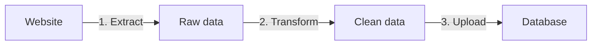

# 9. Data pipelines with metamorph

> **TL;DR:** Chain scrapers into data pipelines -- when one finishes, it triggers the next, with shared access to the same datasets.

> **Note on input format:** Examples show input as JSON. When using `crawlee-one` directly, pass the same fields via the `input` option:
>
> ```ts
> await crawleeOne({ type: '...', input: { startUrls: ['https://...'] } });
> ```

## The problem

One-off analysis can get by with manual post-processing. But if you're feeding scraped data into an application, an ML pipeline, or any automated workflow, you need a data pipeline:



CrawleeOne already handles the transform step via [output transformations](./playbook-04-results-mapping-advanced.md). But the data still needs to go _somewhere_ after scraping.

Typically, this requires a separate orchestration step -- a webhook, a cron job, or manual intervention. Each additional step adds complexity and another point of failure.

## Metamorph inputs

CrawleeOne integrates downstream triggering directly into the scraper input:

- `metamorphActorId` -- ID of the downstream Apify actor to trigger.
- `metamorphActorBuild` -- Build tag of the downstream actor (e.g. `"latest"`).
- `metamorphActorInput` -- Input to pass to the downstream actor.

These are based on [Apify's metamorph feature](https://docs.apify.com/platform/actors/development/programming-interface/metamorph). When the scraper finishes, it triggers the downstream actor, which has access to the same datasets as the original crawler.

```json
{
  "metamorphActorId": "org/data-uploader",
  "metamorphActorBuild": "latest",
  "metamorphActorInput": {
    "logLevel": "info"
  }
}
```

## Chaining multiple steps

If the downstream actor is also built with CrawleeOne, you can chain multiple steps by nesting `metamorphActorInput`:

```json
{
  "metamorphActorId": "org/skcris-scraper",
  "metamorphActorInput": {
    "logLevel": "info",
    "metamorphActorId": "org/data-change-monitoring",
    "metamorphActorInput": {}
  }
}
```

## Custom metamorph behavior

The metamorph inputs default to Apify's metamorph API, but when building a scraper with CrawleeOne, you can override this behavior to trigger your own services instead.

**Result:** Simple data pipelines configured per-crawler, with no external orchestration required.
