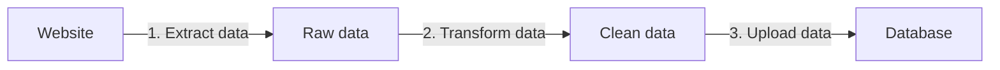
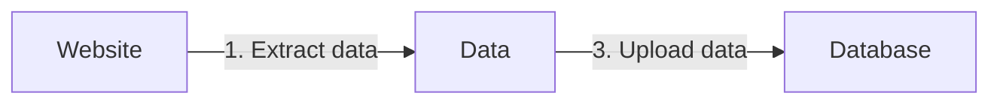

# 9. Create data pipelines from scrapers using metamorph

### Rationale

If you need a dataset for a one-off analysis, you can get by with manual cleanup and
post-processing.

However, if you want to use the data in your app, for training a ML/AI
model, or otherwise programmatically post-process the data, then you will inevitably need
a *data pipeline* - a step-wise process of handling large amounts of data.

A web scraping data pipeline can by as simple as:



Or even simpler, if we don't need to transform the data:



As we've seen before, with Crawlee One, we can take care of *data transformation* from within the scraper.

**However, we still need to send the data *somewhere* after it's scraped.**

Usually this is left up to the user of the scraper. Either they have to manually trigger the data movement, or, on platforms like Apify, they can use a webhook to detect when a scraper has finished.

Either way, they have to define the post-processing in a separate step. This inevitably increases complexity of the project, as you have multiple services configured from within different places.

### Metamorph inputs

That's why Crawlee One has integrated and exposed options that allow you to specify the downstream step via the scraper/actor input:
- `metamorphActorId` - ID of the service / Apify actor to trigger.
- `metamorphActorBuild` - Build ID of the service / Apify actor to trigger.
- `metamorphActorInput` - Input to the downstream service / Apify actor.

These options are based on the [Apify's metamorph feature](https://docs.apify.com/platform/actors/development/programming-interface/metamorph). In short, it means that once your crawler is done, it will trigger a downstream actor/crawler. **This downstream actor will have access to the same datasets as the original crawler.** It is this downstream actor that we would use to do the "Upload data" step from the diagrams.

```json
{
  "metamorphActorId": "jurooravec/skcris-scraper",
  "metamorphActorBuild": "latest",
  "metamorphActorInput": {
    "logLevel": "info",
    ...
  }
}
```

### Chaining

If you have several Crawlee One crawlers/actors then you can chain several of them together, all done by configuring the first one:

```json
{
  // First crawler/actor input
  ...
  "metamorphActorId": "jurooravec/skcris-scraper",
  "metamorphActorInput": {
    // Second crawler/actor input
    "logLevel": "info",
    ...
    "metamorphActorId": "jurooravec/data-change-monitoring",
    "metamorphActorInput": {
      // Third crawler/actor input
      ...
    }
  }
}
```

### Overriding metamorph behaviour

By default, the "metamorph" options relate to the Apify's feature. However, when writing a scraper with Crawlee One, you can override this behaviour. So, if you have a custom scraper, it's possible to specify the options `metamorphActorId` and `metamorphActorInput` to trigger your own services.

> Congrats! With metamorphs, you've learnt how to create simple data pipelines per-crawler, with no need to run an own orchestration layer on top. 🚀
