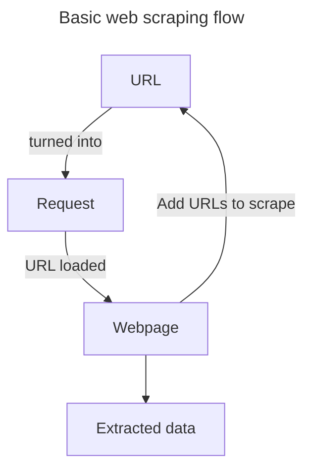
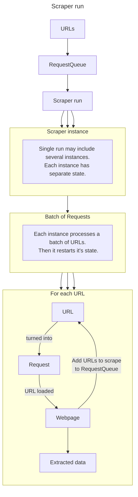

# Scraping flow

### Summary

Before we head deeper into the features, let's recap on how Crawlee scrapers work. In short:

### In-depth

  1. You define a list of URLs to be scraped, and configure the scraper.

  2. You then start a scraper `Run`. Your URLs are turned into `Requests`, and put into the `RequestQueue`.

  3. A single `Run` may start, in parallel, several scraper `Instances`.
  
  4. Each `Instance` takes a `Request` from `RequestQueue`, and loads the URL. Based on the URL loaded:
     - The data is scraped from the page and sent to the `Dataset`.
     - New URLs are found, turned into `Requests`, and sent to `RequestQueue`.

  5. Step 4. continues for as long as there are `Requests` in `RequestQueue`.

  6. In Crawlee One, the `Instance` processes `Requests` in `Batches`. `Requests` in a single `Batch` share the same state and browser instance.

