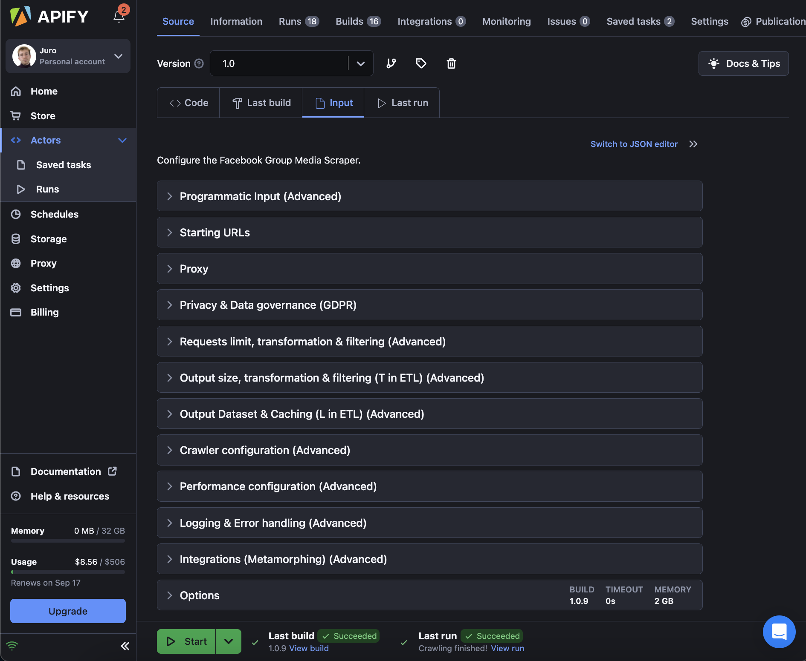
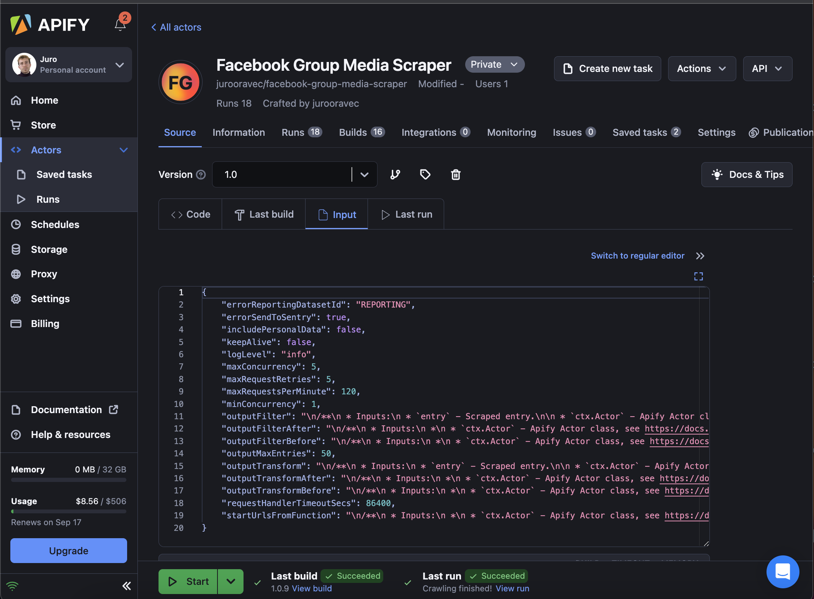

# How to use a Crawlee One scraper

For this section, we'll work with Apify platform. If you're not familiar with it, see their
documentation:

- [Web scraping in 2023: the beginner's guide](https://blog.apify.com/web-scraping-guide/)
- [Introduction to Apify Platform](https://docs.apify.com/academy/apify-platform)

Let's assume you have a scraper that was written with Crawlee One, and you're using it through the Apify platform.

### Via Apify Platform

If everything is configured right, then for your scraper, you should see all
inputs that are made available thanks to Crawlee One:



And this is how it looks when you expand some options:


You can also configure the scraper via the JSON inputs:


### Via Apify Client (JavaScript)

Below is an example of how the same scraper can be configured and run via Apify client.

```js
import { ApifyClient } from 'apify-client';

// Initialize the ApifyClient with API token
const client = new ApifyClient({
  token: '<YOUR_API_TOKEN>',
});

// Prepare Actor input
const input = {
  startUrlsFromDataset: 'datasetid123#url',
  includePersonalData: false,
  outputMaxEntries: 50,
  outputPickFields: ['fieldName', 'another.nested[0].field'],
  outputRenameFields: {
    oldFieldName: 'newFieldName',
  },
  // outputDatasetIdOrName: 'mIJVZsRQrDQf4rUAf',
  // outputCacheStoreIdOrName: 'mIJVZsRQrDQf4rUAf',
  // outputCachePrimaryKeys: ['name', 'city'],
  // outputCacheActionOnResult: 'add',
  maxRequestRetries: 3,
  maxRequestsPerMinute: 120,
  minConcurrency: 1,
  maxConcurrency: 5,
  requestHandlerTimeoutSecs: 180,
  perfBatchSize: 20,
  logLevel: 'info',
  errorReportingDatasetId: 'REPORTING',
  errorSendToSentry: true,
  // metamorphActorId: 'apify/web-scraper',
  // metamorphActorBuild: '1.2.345',
  // metamorphActorInput: {
  //   uploadDatasetToGDrive: true,
  // },
};

(async () => {
  // Run the Actor and wait for it to finish
  const run = await client.actor('n9SpoFa6HTpRTpJta/eR7SNg704bbWmnDe1').call(input);

  // Fetch and print actor results from the run's dataset (if any)
  console.log('Results from dataset');
  const { items } = await client.dataset(run.defaultDatasetId).listItems();
  items.forEach((item) => {
    console.dir(item);
  });
})();
```
