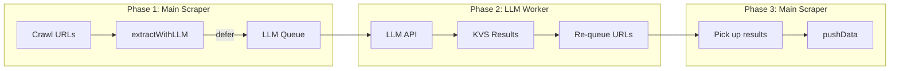

# LLM Extraction Guide

> **TL;DR:** When you come across custom layouts or inconsistent markup, use an LLM to extract structured data from HTML. Use `extractWithLLM()` inside your scraper. Optionally configure via actor inputs `llmApiKey`, `llmProvider`, `llmModel`, etc.; only `model` is required for the LLM call to work.

## What is it?

LLM extraction lets you pull structured data from HTML using a large language model (OpenAI, Anthropic, Google, etc.) instead of DOM selectors. CrawleeOne integrates this as a simple `extractWithLLM()` function.

```typescript
// In the route handler — extractWithLLM from context handles everything
handler: async ({ pushData, extractWithLLM }) => {
  const result = await extractWithLLM({
    schema: llmSchema,
    systemPrompt: '...',
    text: $('.content').html(),  // optional override
  });

  // Result is available when in not null
  if (result == null) return;

  await pushData(result.object, options);
},
```

## When to use it

Use LLM extraction when:

- **DOM selectors fail** — The page uses custom markup, per-company layouts, or non-standard structure (e.g. job boards where some employers have branded detail pages).
- **Markup is inconsistent** — Different sections or pages use different HTML patterns, making selector-based extraction brittle.
- **Content is in non-HTML formats** — PDFs, rich text, or embedded content that is hard to parse with Cheerio.

If simple selectors work, prefer them - they are faster, cheaper, and more predictable.

**extractWithLLMSync** — For cases where deferral is not needed (e.g. few URLs, dev flows), use `extractWithLLMSync` instead. It calls the LLM directly and returns the result (or throws). Same options as `extractWithLLM` minus queue/store IDs and extractionId.

## How it works



1. **Phase 1 — Main scraper:** The crawler visits URLs. For pages that need LLM extraction, the route handler calls `extractWithLLM`. If no result exists yet, the job is pushed to an LLM queue and the handler returns (the request is not reclaimed). The crawl continues.
2. **Phase 2 — LLM worker:** The LLM crawler runs **concurrently** with the main crawler. It processes the queue: sends HTML to the LLM, stores the structured result in a key-value store, and re-queues the original URLs in the main crawler's request queue.
3. **Phase 3 — Main scraper again:** The main scraper processes the re-queued URLs. `extractWithLLM` finds the stored result, returns it, and the handler calls `pushData`.

For full implementation details (queue IDs, KVS semantics, re-queue behavior), see [LLM Extraction Flow (development)](./development/llm-extraction-flow.md).

## Configuring input

All `llm*` actor inputs are **optional**. Provide them in crawler input (or Apify actor input) to configure the LLM. For the LLM call to succeed, **only `model` must be provided** (via actor input or per-call options); `apiKey` can come from `OPENAI_API_KEY` env.

| Field                | Required | Description                                                                  |
| -------------------- | -------- | ---------------------------------------------------------------------------- |
| `llmModel`           | Yes\*    | Model ID (e.g. `gpt-4o`, `claude-3-5-sonnet-20241022`). Required for call.   |
| `llmApiKey`          | No       | API key for the LLM provider. Defaults to `OPENAI_API_KEY` env when omitted. |
| `llmProvider`        | No       | Provider ID: `openai`, `anthropic`, `google`, `deepseek`, `ollama`, etc.     |
| `llmBaseUrl`         | No       | Override API endpoint (e.g. Azure OpenAI, custom OpenAI-compatible API).     |
| `llmHeaders`         | No       | Custom headers for the LLM API.                                              |
| `llmRequestQueueId`  | No       | Override LLM request queue ID. Defaults to run-scoped `llm-{runId}`.         |
| `llmKeyValueStoreId` | No       | Override LLM key-value store ID. Defaults to run-scoped `llm-{runId}`.       |

Example:

```json
{
  "llmApiKey": "sk-...",
  "llmProvider": "openai",
  "llmModel": "gpt-4o"
}
```

Full reference: [LlmActorInput](./typedoc/interfaces/LlmActorInput.md).

## Running the workflow

### Local development (`crawlee-one dev`)

1. Optionally add `llmModel`, `llmApiKey`, `llmProvider` to `devInput` in `crawlee-one.config.ts` (e.g. `llmApiKey: process.env.OPENAI_API_KEY`).
2. Run `npx crawlee-one dev` from the scraper directory. The scraper and LLM crawler run together in the same process — deferred pages are processed automatically as they arrive.

### Production (Apify)

**Built-in orchestration:** crawlee-one always runs the LLM crawler **concurrently** with the main crawler. When the scraper finishes, it waits for the LLM queue to drain; if the LLM re-queues URLs to the main queue, the scraper is re-run. No separate `llm extract` step or custom orchestration file is needed.

**Run-scoped queue and store:** With the default `llm` IDs, crawlee-one automatically scopes them per run (e.g. `llm-{runId}` on Apify, `llm-t{timestamp}` locally). This prevents cross-run interference and avoids runs that never finish because other actors keep adding to the same queue.

**Option B — Manual phases (separate runs):**

1. Set `llmModel`, `llmApiKey`, and `llmProvider` in the actor input (use Apify secrets for the key).
2. Run the main actor — it defers LLM pages to the queue.
3. Run a second actor (or a scheduled task) that executes `crawlee-one llm extract` with access to the **same** storage. Pass `llmRequestQueueId` and `llmKeyValueStoreId` from the main run (format: `llm-{runId}` — get `runId` from the main run in Apify Console).
4. Run the main actor again — it collects the LLM results and pushes them to the dataset.

Some setups run the main scraper and LLM worker as separate Apify actors, sharing storage via the run-scoped IDs. See your scraper's README for recommended deployment.

## Example: Profesia-sk

The Profesia-sk scraper (`scrapers/profesia-sk`) uses LLM extraction for custom-design job pages — pages where employers use non-standard HTML.

Standard pages use DOM-based extraction; custom pages fall back to the LLM.

### Route

The "custom design" route uses multiple methods to detect custom pages:

- Via DOM - CSS clases (`.maintextearea`)
- Resources - CSS from `/customdesigns/`
- Data layer (`"dimensionOfferType":"Custom design"`)

We then call `extractWithLLM()` inside the handler body.

`extractWithLLM()` doesn't receive the text, so it's taken from the response.

`extractWithLLM()` also doesn't specify any model info - provider, model, API key - so these all MUST be provided via Actor inputs as `llmApiKey`.

```ts
export const jobCustomRoute = {
  sampleUrls: [
    'https://www.profesia.sk/praca/accenture/O4491399',
  ],
  match: [
    (url, ctx) => ...
  ],
  handler: async (ctx) => {
    const result = await ctx.extractWithLLM({
      schema: llmJobOfferSchema,
      systemPrompt: LLM_JOB_EXTRACTION_SYSTEM_PROMPT,
    });

    if (result == null) return;

    await ctx.pushData(result,
      {
        privacyMask: {
          employerContact: true,
          phoneNumbers: true,
        },
      },
    );
  },
};
```

### Schema

Use Zod with `.default([])` for optional arrays. For URL fields, avoid `z.string().url()` — OpenAI's `response_format` rejects the `uri` format. Use `.refine()` instead:

```ts
const zUrlForLlm = z
  .string()
  .min(1)
  .refine((s) => {
    try {
      new URL(s);
      return true;
    } catch {
      return false;
    }
  })
  .nullable();

export const llmJobOfferSchema = z.object({
  salaryRange: zStrNotEmptyNullable,
  salaryRangeLower: zNumIntNonNegNullable,
  salaryRangeUpper: zNumIntNonNegNullable,
  salaryCurrency: zStrNotEmptyNullable,
  salaryPeriod: zStrNotEmptyNullable,
  listingUrl: zUrlForLlm,
  employerName: zStrNotEmptyNullable,
  employerUrl: zUrlForLlm,
  employerLogoUrl: zStrNotEmptyNullable,
  offerName: zStrNotEmptyNullable,
  offerUrl: zUrlForLlm,
  offerId: zStrNotEmptyNullable,
  location: zStrNotEmptyNullable,
  labels: z.array(z.string()).default([]),
  lastChangeRelativeTime: zStrNotEmptyNullable,
  lastChangeType: zStrNotEmptyNullable,
  jobInfoResponsibilities: zStrNotEmptyNullable,
  jobInfoBenefits: zStrNotEmptyNullable,
  jobInfoDeadline: z.preprocess(
    (v) => (v === undefined || v === '' ? null : v),
    zStrNotEmptyNullable
  ),
  jobReqEducation: zStrNotEmptyNullable,
  jobReqExpertise: zStrNotEmptyNullable,
  jobReqLanguage: zStrNotEmptyNullable,
});
```

### System prompt

Instructs the LLM on language (Slovak/English), field formats (employment types, datePosted, URLs), and to output valid JSON with `null` for missing values.

```ts
/** System prompt for LLM extraction of job offers from Profesia.sk custom-design pages */
export const LLM_JOB_EXTRACTION_SYSTEM_PROMPT = `You are extracting structured job offer data from HTML of a Slovak job board (Profesia.sk) custom-design page.

The page may be in Slovak or English. Extract all visible job details.

Return valid JSON matching the schema. Use null for missing values.

For employmentTypes, use: fte, pte, selfemploy, voluntary, internship (infer from text like "plný úväzok" = fte, "skrátený" = pte).

For datePosted, use YYYY-MM-DD format (date-only; the site provides dates, not full datetimes).

For locationCategs and professionCategs, extract links and names where available; use empty arrays if none.

For offerId, extract from URL pattern like O3964543.

Copy long-form text as-is, do not summarize or paraphrase.

For nullable fields, use JSON null (not the string "null") when the value is missing.

If a Page URL is provided with the content, resolve any relative URL paths (e.g. /path or /path?query=1) to absolute URLs using that Page URL as the base. All url fields (listingUrl, employerUrl, employerLogoUrl, offerUrl, and url in locationCategs/professionCategs) must be valid absolute URLs (with https:// and host) or null. Do not output relative paths.`;
```

## Model selection

Choose a model based on accuracy, cost, and latency. Common options:

| Provider  | Model                                                 | Notes                                                                  |
| --------- | ----------------------------------------------------- | ---------------------------------------------------------------------- |
| OpenAI    | `gpt-5-mini`, `gpt-5.2`, `gpt-5.2-pro`, `gpt-4o-mini` | [Models](https://developers.openai.com/api/docs/models)                |
| Anthropic | `claude-3-5-sonnet-20241022`                          | [Models](https://docs.anthropic.com/en/docs/about-claude/models)       |
| Google    | `gemini-1.5-pro`, `gemini-1.5-flash`                  | [Models](https://cloud.google.com/vertex-ai/generative-ai/docs/models) |
| DeepSeek  | `deepseek-chat`                                       | [Docs](https://api-docs.deepseek.com/quick_start/pricing)              |
| Ollama    | `llama3`, `mistral`                                   | [Models](https://ollama.com/models) — for local/dev                    |

**Recommended for production:** As of 02/2026, **`gpt-5-mini`** offers the best balance of quality (~80% agreement with reference), cost (~$0.015/req), and speed. Use `gpt-5.2-pro` as a reference model for complex schemas; avoid `gpt-4o-mini` for structured extraction — it tends to summarise or misplace content. Run `crawlee-one llm compare` on your URLs and schema to evaluate models; see [LLM compare guide](./llm-compare-guide.md).
