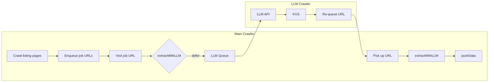

# 9. Multi-crawler orchestration

> **TL;DR:** Run multiple crawlers side-by-side in one process so slow-running jobs (LLM extraction, API enrichment, etc.) run alongside the main crawler instead of blocking it.

## The problem

The main crawler visits pages quickly, but some work is slow: LLM calls, external API lookups, image analysis, or heavy parsing. If you do that work in the same request handler, the main crawler blocks and throughput drops.

The solution is to **defer slow jobs to a separate crawler**. The main crawler hands work off and keeps going; a worker crawler processes the slow queue and re-queues results when done. Both run at the same time.

CrawleeOne's orchestration ensures they keep running until all queues drain - including when the worker adds work back to the main queue.

## Typical examples

Any workflow where you need to use a slow or third party service for data enrichment:

- **LLM extraction** — The main crawler defers pages with inconsistent markup to an LLM queue. The LLM crawler extracts structured data, stores it, and re-queues the URL to the main crawler.

- **External API enrichment** — The main crawler finds product URLs and defers enrichment (e.g. price lookup via a third-party API with rate limits). A worker crawler calls the API, stores the result, and re-queues for the main crawler to merge and push.

- **Image or document analysis** — The main crawler discovers media URLs and defers OCR or image classification to a worker. The worker runs a vision model or external service and stores the result for the main crawler to pick up.

- **Validation or verification** — The main crawler extracts data and defers cross-checking. A worker validates, stores the outcome, and re-queues so the main crawler can include or discard the entry.

- **Heavy parsing** — The main crawler defers pages with large or complex DOM to a dedicated parser crawler that uses more CPU or memory. Results go back to the main queue.

In each case, the main crawler keeps moving; slow work runs in parallel. Orchestration handles the handoff and ensures both crawlers run until all work is done.

## Example: LLM extraction

Imagine a job board where:

- **Listing pages** — Consistent HTML; DOM selectors work.
- **Detail pages** — Some employers use custom layouts (e.g. `.branded-job`, `.employer-custom`). Selectors fail; we use LLM extraction.

The flow:

1. Main crawler visits listing pages, enqueues job URLs.
2. Main crawler visits a job URL. If it's a custom layout, `extractWithLLM` defers to the LLM queue and returns `null`.
3. LLM crawler processes the queue: sends HTML to the LLM, stores the result, re-queues the URL to the main crawler.
4. Main crawler picks up the re-queued URL, `extractWithLLM` finds the result, we `pushData`.



How it works:

- Both crawlers run concurrently.
- When the main crawler "finishes" (its queue is empty), the LLM queue might still have work, so we wait.
- The LLM might push requests to the main crawler's queue.
- Orchestration waits, checks queues, and re-runs whichever crawler has new work until all queues are empty.

## When to use orchestration

CrawleeOne supports the **LLM extraction** out of the box, and runs the main and LLM crawlers together automatically - you don't need to call `orchestrate` yourself. See the [LLM extraction guide](./llm-extraction-guide.md).

Use this playbook when:

- You have a **custom** slow-job pattern (API enrichment, image analysis, validation, etc.).

## Step-by-step setup

### Step 1: Define crawlers

For each crawler, include:

- `queueId` - Request queue that holds the requests for this crawler.
- `isKeepAlive` - Whether the crawler was configured to be kept alive.

### Step 2: Call `orchestrate()` inside `onReady` callback

`onReady` callback is where you normally start the crawler (`context.crawler.run()`).

It's also when you should start your multi-crawler orchestration.

```ts
import {
  crawleeOne,
  orchestrate,
  createLlmCrawler,
  type OrchestratedCrawler,
} from 'crawlee-one';

await crawleeOne(
  {
    type: 'cheerio',
    routes: { ... },
  },
  async (context) => {
    // Step 1a: Create the LLM crawler
    // (keepAlive — runs until we stop it)
    const llmCrawler = await createLlmCrawler({
      requestQueueId: context.input?.llmRequestQueueId ?? 'llm',
      keyValueStoreId: context.input?.llmKeyValueStoreId ?? 'llm',
      keepAlive: true,
    });

    // Step 1b: Main crawler (wrapped to pass startUrls)
    // (not keepAlive — exits when queue empty)
    let urlsToPass = context.startUrls;
    const mainRun = async () => {
      await context.crawler.run(context.startUrls);
      urlsToPass = [];
    };

    // Step 2: Run the crawlers together
    const crawlers: OrchestratedCrawler[] = [
      {
        crawler: { run: mainRun, stop: () => {} },
        queueId: context.input?.requestQueueId,
        isKeepAlive: false,
      },
      {
        crawler: llmCrawler,
        queueId: context.input?.llmRequestQueueId ?? 'llm',
        isKeepAlive: true,
      },
    ];

    await orchestrate({ crawlers, checkIntervalMs: 5000 });
  }
);
```

## How orchestration works

1. **Start keep-alive crawlers** — They run in the background until we call `stop()`.
2. **Run non-keep-alive crawlers** — They process their queues and exit when empty.
3. **Reactive reconciliation** — When any non-keep-alive crawler finishes, wait `checkIntervalMs`, then check all queues. If a crawler's queue has new work (e.g. from another crawler re-queuing), start that crawler again.
4. **Done when all queues empty** — Once all non-keep-alive crawlers have stopped and all queues (including keep-alive) are empty, call `stop()` on keep-alive crawlers and exit.

Throughput is not limited by the slowest crawler - we react as soon as any single one finishes.

## Result

A single process runs multiple crawlers that exchange work via queues. The main crawler stays fast; slow jobs run in parallel. No separate extraction step, no manual re-runs — the orchestration loop handles re-queuing automatically.
