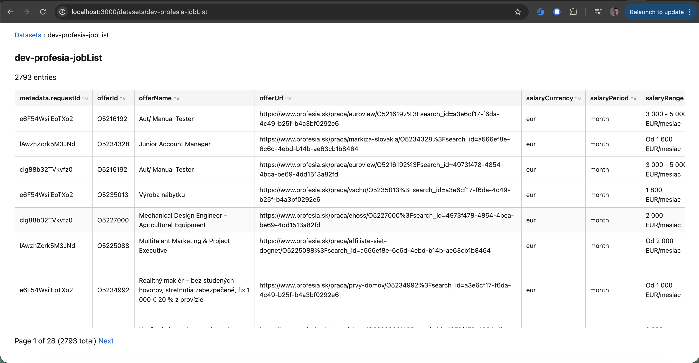

# Preview datasets

The `crawlee-one preview` command starts a local web server to browse scraped datasets. It reads from local storage (`storage/datasets` or `APIFY_LOCAL_STORAGE_DIR`) and serves a simple UI to list datasets, view entries in tabular form, and inspect individual items as JSON.



**Local storage only.** Cloud datasets are not supported yet.

## Usage

```sh
crawlee-one preview
```

The server prints the URL. Open it in your browser to view datasets.

## Options

| Option                   | Description                                                 | Default     |
| ------------------------ | ----------------------------------------------------------- | ----------- |
| `-p, --port <port>`      | Port to listen on                                           | `3000`      |
| `-c, --config-dir <dir>` | Directory containing crawlee-one config (uses its storage/) | cwd storage |

## Examples

```sh
# Start preview server (default port 3000)
npx crawlee-one preview

# Use a different port
npx crawlee-one preview -p 3000

# Preview datasets from a specific scraper project
npx crawlee-one preview -c ./scrapers/profesia-sk

# Use custom storage path via env
APIFY_LOCAL_STORAGE_DIR=./storage npx crawlee-one preview
```

## Programmatic usage

You can start the preview server from code by calling `startPreviewServer` with `PreviewServerOptions`:

```ts
import { startPreviewServer } from 'crawlee-one';

const { port, url } = await startPreviewServer({
  port: 3000,
  storageDir: './storage',
});

console.log(`Preview at ${url}`);
```

| Option       | Description                                                    | Default            |
| ------------ | -------------------------------------------------------------- | ------------------ |
| `port`       | Port to listen on                                              | `3000`             |
| `storageDir` | Override storage directory (otherwise from env or cwd/storage) | env or `./storage` |

## Pages

- **`/`** — Redirects to `/datasets`
- **`/datasets`** — List of datasets with item counts
- **`/datasets/:id`** — Paginated table of entries (100 per page). Nested objects are flattened with dot notation; array fields are shown as JSON. Supports filtering and column sorting.
- **`/datasets/:id/:entryId`** — Single entry as pretty-printed JSON

## Filter

A textarea above the table lets you filter entries with a JavaScript expression. The expression receives `obj` (the entry's data object) and should return truthy to include the entry.

```javascript
obj.name === 'Alice';
obj.count > 100;
obj.metadata?.actorRunUrl?.includes('profesia');
obj.tags?.includes('remote');
```

**Security:** The script runs on the server. Use only for local preview; never publish this page.

## Data format

The table view follows the same flattening as CSV export:

- **Nested objects:** `{ data: { name: "John" } }` → column `data.name`
- **Arrays:** Serialized as JSON string — `{ tags: ['a','b'] }` → column `tags` with value `["a","b"]`
